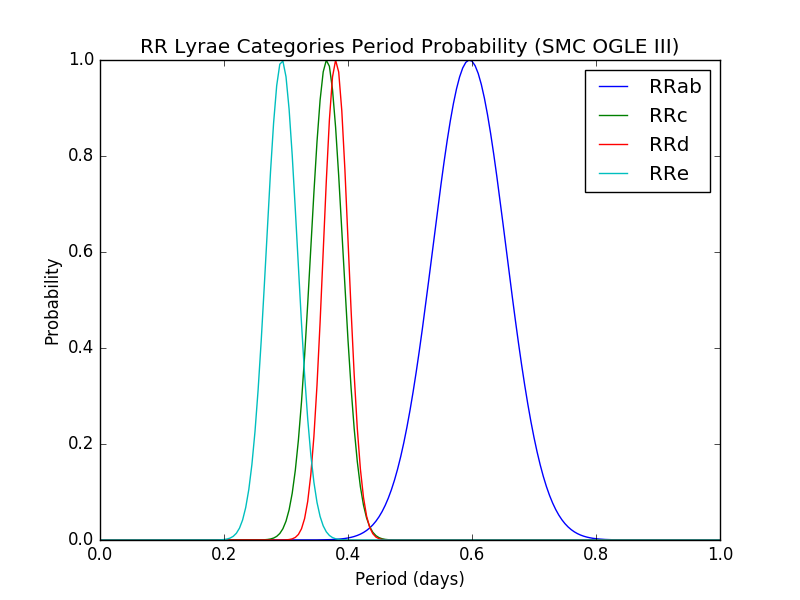

# Scripts
These are the scripts that we used for analyzing the OGLE III and IV RR Lyrae Data.

## mean-sd.R
Calculates the mean and standard deviation of the given data.

```
$ ./mean-sd.R ~/Documents/ogle/ogle3/smc/RRab-periods.dat
0.595879 
0.05925889
```

### Usage
Command structure:

```
./mean-sd.R DATA_FILE
```

Data file structure:

```
PERIOD_1
PERIOD_2
...
```

Example data file:

```
0.5588141
0.5947913
0.6506693
0.5652567
0.5471791
0.6328832
0.6947615
0.5530407
0.5957614
0.6256321
```

Output structure:

```
MEAN
STANDARD_DEVIATION
```

## scatter.py
Creates a scatter graph of all of the given period values.

```
$ python scatter.py "RRab Periods (SMC OGLE III)" "Number" "Period (days)" ../graphs/ogle3_smc_RRab_scatter.png < ~/Documents/ogle/ogle3/smc/RRab-periods.dat
```


### Usage
Command structure:

```
python scatter.py TITLE X_AXIS Y_AXIS OUTPUT_FILE < DATA_FILE
```

Data file structure:

```
PERIOD_1
PERIOD_2
...
```

Example data file:

```
0.5588141
0.5947913
0.6506693
0.5652567
0.5471791
0.6328832
0.6947615
0.5530407
0.5957614
0.6256321
```

## function.py
Creates a graph of a probability function using provided mean and standard deviation values.

```
$ python function.py "RRab Period Probability (SMC OGLE III)" "Period (days)" "Probability" ../graphs/ogle3_smc_RRab_probability.png < ~/Documents/ogle/ogle3/smc/RRab-stats.dat
```


### Usage
Command structure:

```
python function.py TITLE X_AXIS Y_AXIS OUTPUT_FILE < DATA_FILE
```

Data file structure:

```
MEAN
STANDARD_DEVIATION
```

Example data file:

```
0.595879
0.05925889
```

## functions-overlay.py
Creates a graph of the given period probability functions.

```
$ python functions-overlay.py "RR Lyrae Categories Period Probability (SMC OGLE III)" "Period (days)" "Probability" ../graphs/ogle3_smc_overall_probability.png < ~/Documents/ogle/ogle3/smc/overall.dat
```



### Usage
Command structure:

```
python functions-overlay.py TITLE X_AXIS Y_AXIS OUTPUT_FILE < DATA_FILE
```

Data file structure:

```
NUMBER_OF_FUNCTIONS
FUNCTION_1_NAME
FUNCTION_1_MEAN
FUNCTION_1_STANDARD_DEVIATION
FUNCTION_2_NAME
FUNCTION_2_MEAN
FUNCTION_2_STANDARD_DEVIATION
...
```
Example data file:

```
4
RRab
0.595879
0.05925889
RRc
0.3657921
0.02584546
RRd
0.3804337
0.02022942
RRe
0.2933169
0.0251186
```
